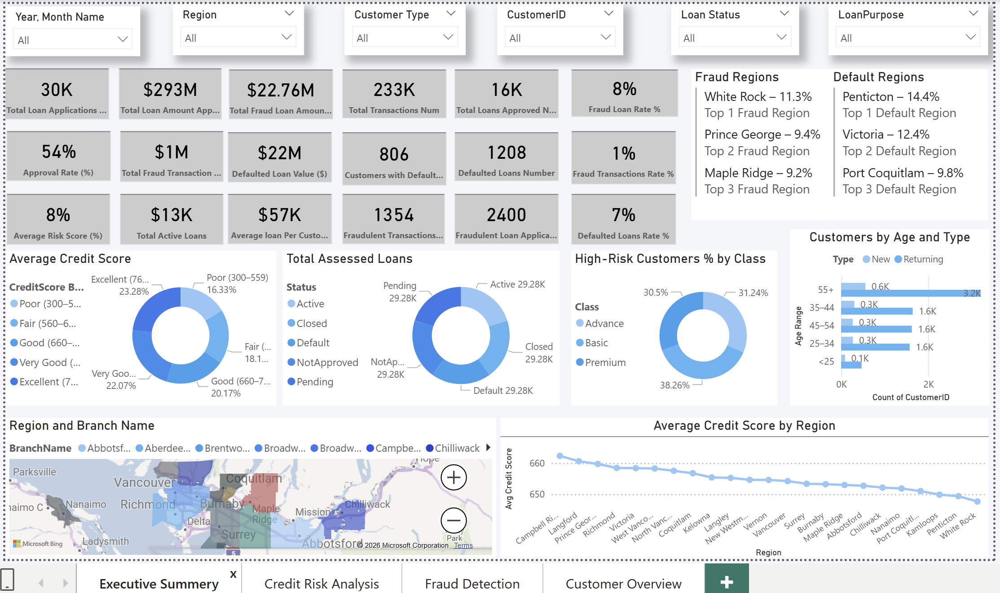
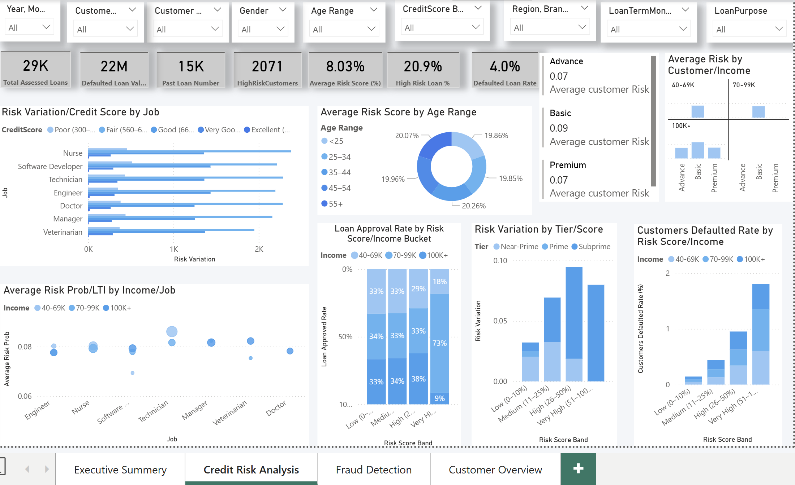
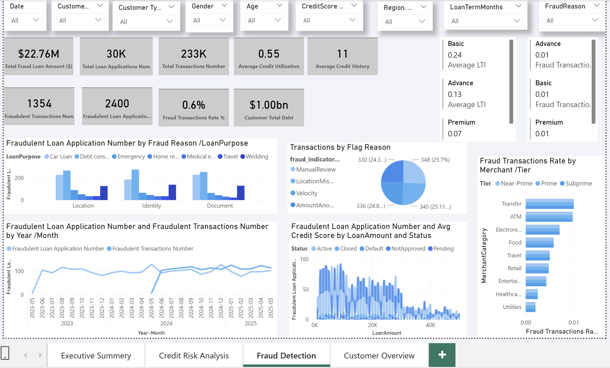
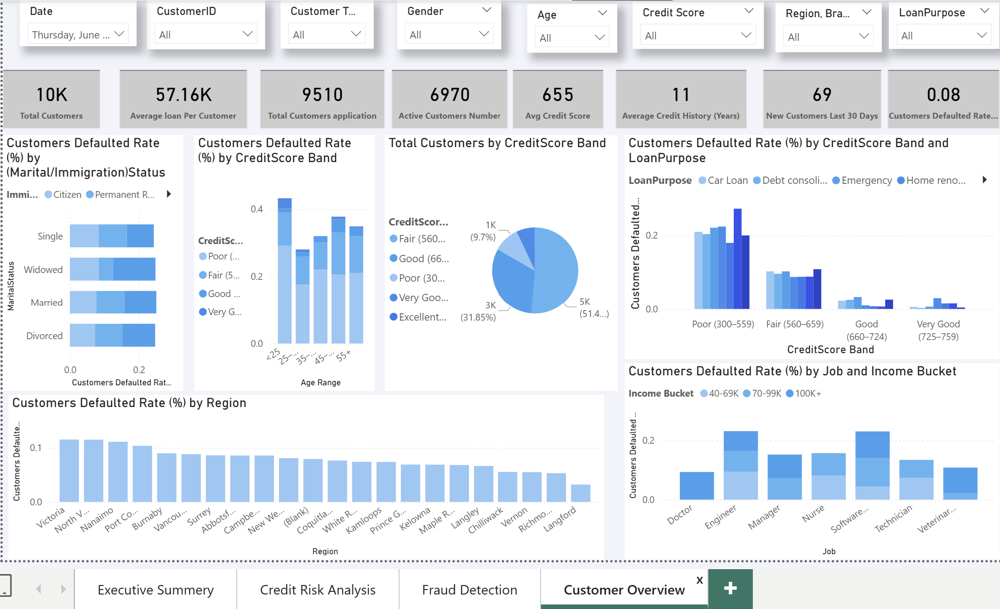

# Power BI Loan Risk Analysis Dashboard
Power BI dashboard for loan application analysis, credit risk assessment, and fraud detection using KPI-driven visual insights.
## Tools & Skills
- Power BI
- DAX
- Data Modeling
- KPI Design
- Credit Risk Analysis
## Dashboard Preview

### Executive Summary

### Credit Risk Analysis

### Fraud Detection

### Customer Overview

